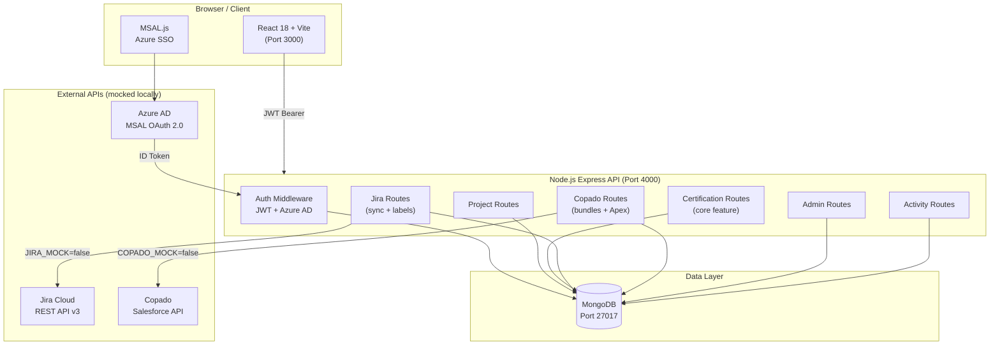
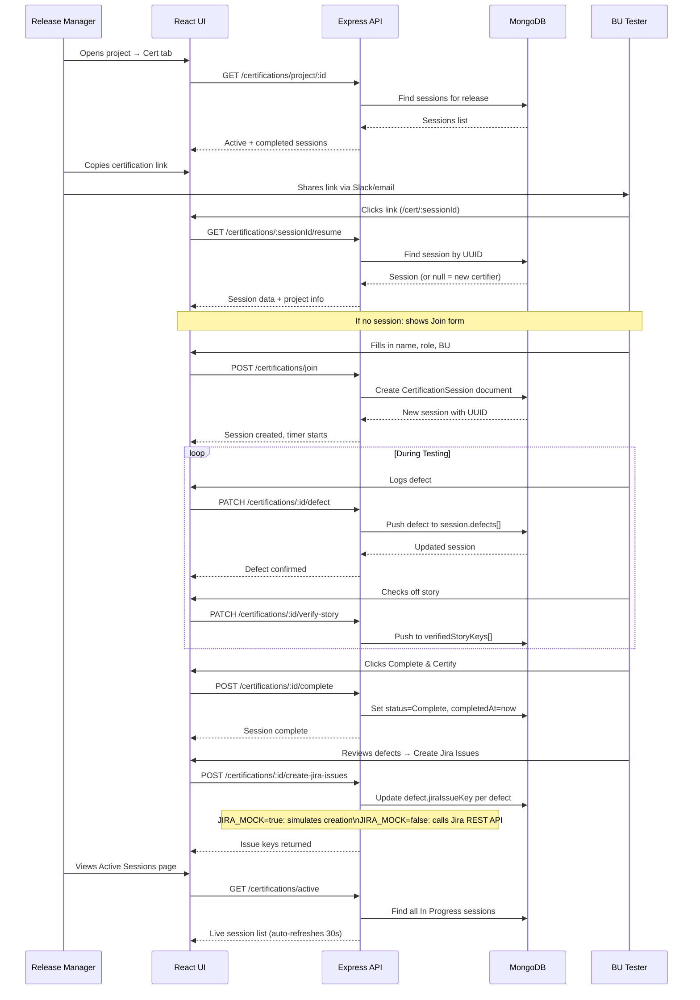
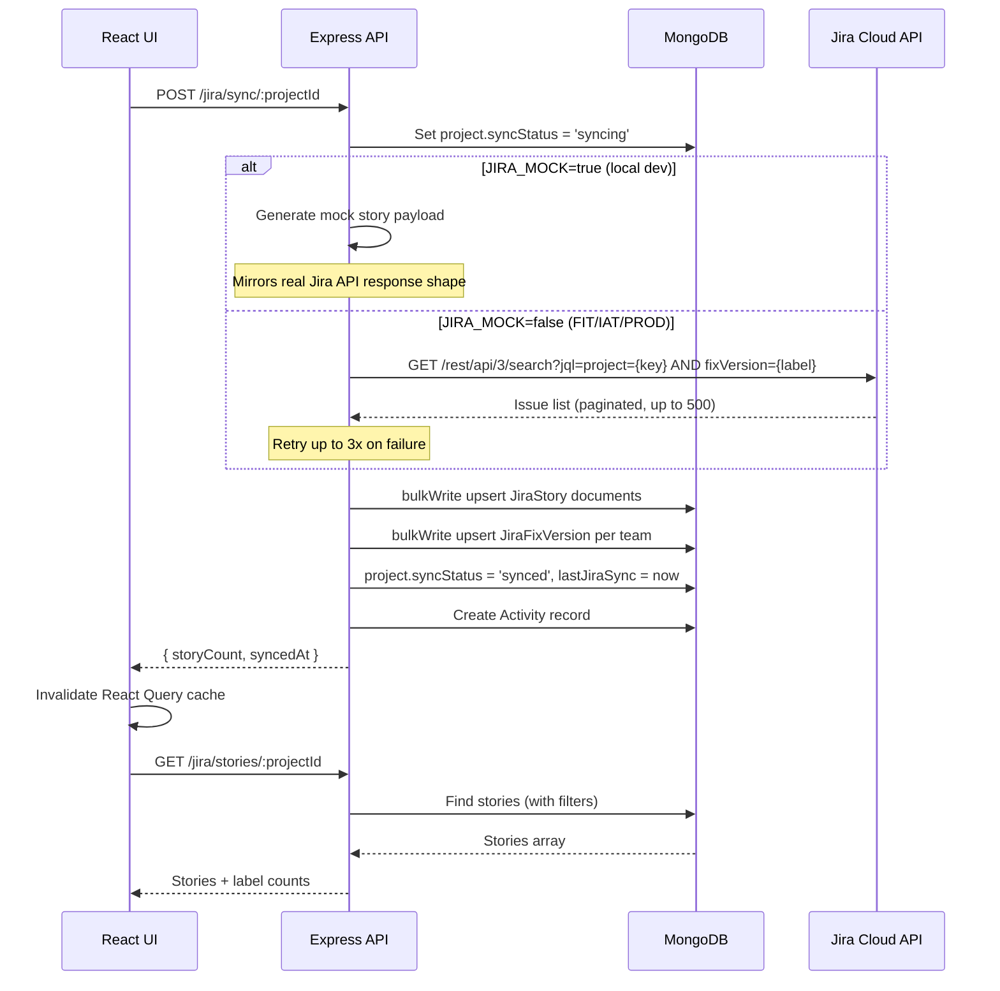
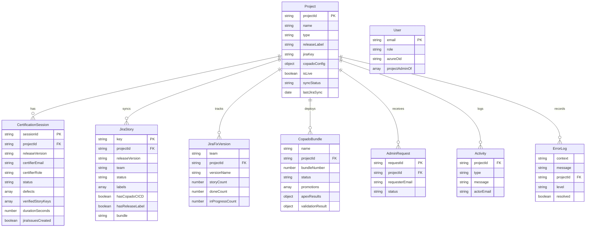
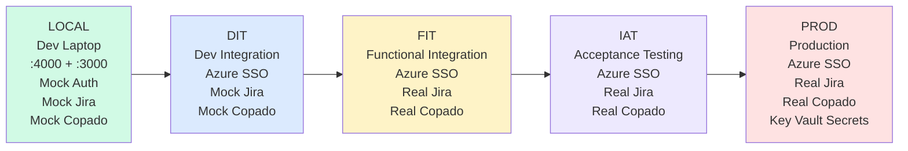

# ReleaseIQ — Architecture Document
**ADP Release Management Platform**
Version 1.0 | March 2026

---

## Executive Summary

ReleaseIQ is an internal ADP platform that centralizes Salesforce and React release management. It replaces manual spreadsheet tracking and disconnected Slack coordination with a unified dashboard, real-time Jira sync, Copado bundle tracking, and a structured certification workflow for release night.

**Key outcomes:**
- Release managers see every team's Jira story status in one screen
- BU testers join certification via a shared link — no login required
- All defects logged during certification auto-populate Jira bulk-create
- Copado promotion status and Apex test coverage tracked in real time
- Session data persists in MongoDB — closing a browser does not lose session

---

## System Architecture



---

## Data Flow: Certification Session Lifecycle



---

## Data Flow: Jira Sync



---

## MongoDB Collections



---

## Environment Architecture



---

## API Endpoint Map

| Method | Endpoint | Auth | Description |
|--------|----------|------|-------------|
| POST | `/api/auth/mock-login` | None | Local dev login |
| POST | `/api/auth/azure/callback` | None | Azure AD token exchange |
| GET | `/api/auth/me` | JWT | Current user profile |
| GET | `/api/projects` | JWT | List all projects |
| GET | `/api/projects/:id` | JWT | Single project |
| POST | `/api/projects` | Main Admin | Create project |
| PATCH | `/api/projects/:id` | Project Admin | Update settings |
| POST | `/api/projects/:id/toggle-live` | Project Admin | Toggle LIVE status |
| GET | `/api/certifications/active` | JWT | All in-progress sessions |
| GET | `/api/certifications/project/:id` | JWT | Sessions for project |
| GET | `/api/certifications/:sessionId` | JWT | Single session |
| GET | `/api/certifications/:sessionId/resume` | **None** | Resume via share link |
| POST | `/api/certifications/join` | JWT | Create/join session |
| PATCH | `/api/certifications/:id/defect` | JWT | Log a defect |
| PATCH | `/api/certifications/:id/verify-story` | JWT | Mark story verified |
| POST | `/api/certifications/:id/complete` | JWT | Complete session |
| POST | `/api/certifications/:id/create-jira-issues` | JWT | Bulk create Jira bugs |
| POST | `/api/jira/sync/:projectId` | JWT | Trigger Jira sync |
| GET | `/api/jira/stories/:projectId` | JWT | Get synced stories |
| GET | `/api/jira/fix-versions/:projectId` | JWT | Fix version breakdown |
| PATCH | `/api/jira/story/:id/:key/label` | Project Admin | Add Jira label |
| GET | `/api/copado/bundles/:projectId` | JWT | Get Copado bundles |
| POST | `/api/copado/sync/:projectId` | Project Admin | Sync from Copado |
| POST | `/api/copado/test-connection` | Project Admin | Test Copado credentials |
| GET | `/api/admin/requests` | Main Admin | List access requests |
| POST | `/api/admin/requests` | JWT | Submit access request |
| PATCH | `/api/admin/requests/:id/approve` | Main Admin | Approve request |
| PATCH | `/api/admin/requests/:id/deny` | Main Admin | Deny request |
| GET | `/api/admin/errors` | JWT | Error log |
| DELETE | `/api/admin/errors` | Main Admin | Clear error log |
| GET | `/api/admin/users` | Main Admin | List all users |
| GET | `/api/activity` | JWT | Activity feed |

---

## Security Model

| Role | Can Do |
|------|--------|
| **Main Admin** | Everything — create/delete projects, manage all users, approve access requests, view all error logs |
| **Project Admin** | Configure their project(s), trigger syncs, manage Copado config, view project error logs |
| **User** | View all projects, join certification sessions (via link or auth) |
| **Unauthenticated** | Resume cert session via UUID share link only (`/cert/:sessionId`) |

**Certification link security model:** The session UUID (`/cert/:sessionId`) is the credential for BU testers. No SSO required to land on the join screen. This is intentional — external BU testers who may not have Azure AD need to join. The join form collects their name + email + role as the identity.

---

## Tech Stack

| Layer | Technology | Version |
|-------|-----------|---------|
| API Framework | Express.js + TypeScript | 4.18 / 5.2 |
| Database | MongoDB + Mongoose | 7.0 / 7.6 |
| Auth (Prod) | Azure AD MSAL + JWT | MSAL v3 |
| Auth (Dev) | Mock JWT | — |
| Frontend | React + Vite | 18 / 5.0 |
| State (Server) | TanStack React Query | v5 |
| State (Client) | Zustand | v4 |
| HTTP Client | Axios | v1.6 |
| Routing | React Router | v6 |
| Logging | Winston | v3 |
| Cron | node-cron | v3 |

---

## Local Development Quick Start

```bash
# 1. Clone and setup
git clone <repo>
cd releaseiq
chmod +x scripts/setup.sh
./scripts/setup.sh       # installs deps, seeds DB

# 2. Start API (Terminal 1)
cd api && npm run dev     # http://localhost:4000

# 3. Start UI (Terminal 2)
cd ui && npm run dev      # http://localhost:3000

# 4. Login with demo account
# Go to http://localhost:3000
# Use: john.doe@adp.com (Main Admin)
#      jane.smith@adp.com (Project Admin)
#      tester.bu@adp.com (BU Tester)
```

---

## Connecting Real APIs

See [`docs/CONNECTING_REAL_APIS.md`](./CONNECTING_REAL_APIS.md) for step-by-step instructions on connecting Jira, Copado, and Azure AD.
